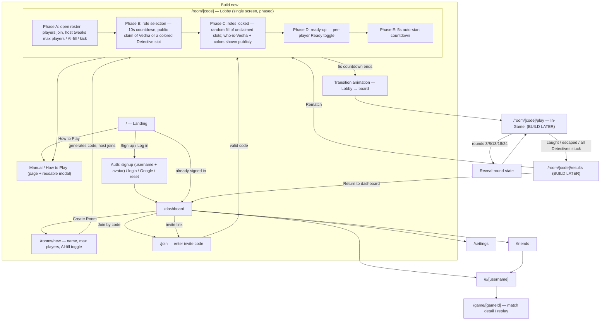

# Find Vedha — Master Sitemap

> **Status:** DRAFT v2 — awaiting your approval.
> Single source of truth for every screen and state. If it is not in this document, we do not build it without adding it here first.
> Authoritative input: Project Brief **Section 3.5 (Full End-to-End User Flow)** + the exact ruleset in Section 3.
> Last updated: 2026-08-30 — v2 folds in the updated brief (rich Lobby with public role claim + timers; no separate Role Reveal screen).

---

## 0. Confirmed decisions

### 0.1 Naming & identity
| Thing | Decision |
|---|---|
| Product name | **Find Vedha** (working title) |
| The hidden player | **Runner** — in-world character **Vedha** |
| The pursuing players | **Detectives** (5 Detective pawns split among players) — settled term, the authentic Scotland Yard word. Don't reintroduce "Tracker" or "Chaser". |
| Detective slot colors | D1 **Blue** · D2 **Orange** · D3 **Purple** · D4 **Pink** · D5 **Cyan**. Deliberately avoid yellow/green/red — those are the transport-line colors. CSS vars stay `--tr-1`…`--tr-5`. (Proposal — adjust in Phase 0.) |
| Vedha marker | Neutral "?" token in the Detective view; on reveal rounds a high-contrast pulsing pin (not yellow/green/red). |
| The board | 199 numbered nodes, **no named landmarks** (deliberate deviation from brief §3 boilerplate, per your instruction — "just nodes and a neat map bg"). Background art reads as Chennai (east-edge coastline, two abstract river curves), **no labels, no gameplay effect**. |
| Transport tiers | **Auto** = yellow lines · **Bus** = green lines · **Metro** = red lines |
| "Who is Vedha" vs "where is Vedha" | **Vedha's identity is PUBLIC** from the lobby onward — everyone knows which player is Vedha. **Vedha's board position is HIDDEN** during play except on reveal rounds. These are separate; never conflate them. |

### 0.2 Ruleset (adapted from Scotland Yard — keep every number)
| Rule | Value |
|---|---|
| Players per room | 2–6 |
| Pawns | 1 Runner (Vedha) + 5 Detective pawns. With <6 players, a player controls more than one Detective pawn. |
| Board nodes | exactly 199 |
| Transport layering | Auto at every node (base). Bus only at busier nodes. Metro only at major hubs. No node has Bus or Metro without Auto. A node's available transports = whichever colored edges touch it (no separate field). |
| Detective tickets (per pawn) | 10 Auto · 8 Bus · 4 Metro |
| Runner tickets | 4 Auto · 3 Bus · 3 Metro · 5 Wildcard · 2 Double-Move |
| Wildcard | Any transport type; **hides which transport type was used** from Detectives (destination is hidden anyway). Also the **only** ticket that can cross a **river / black-line edge** (Wildcard-only shortcut routes — see below). |
| Double-Move | Two consecutive Runner moves before Detectives respond. If a reveal round lands on the first move, reveal happens after that first move. |
| Start positions | Random draw from a fixed pool of ~20 designated start nodes, spread across the map. Runner + 5 Detectives all draw **distinct** nodes from the same pool. |
| Rounds | 24 |
| Reveal rounds | **3, 8, 13, 18, 24** — Vedha's exact node shown to all Detectives, then hidden again on Vedha's next move. |
| Turn order | Runner first each round, then Detectives move **sequentially**, one at a time, each move visible to the others. |
| Movement | One stop per ticket (no skipping stops). Everyone must move each turn — no passing. |
| Detective blocking | A Detective cannot move onto a node occupied by another Detective. |
| Catch | Any Detective moving onto Vedha's exact node → **Detectives win immediately.** Same if Vedha is forced onto an occupied Detective node. |
| Stuck Detective | No usable ticket for any connection → stuck for the rest of the game; still blocks its node, **auto-skipped in turn rotation**, marked "stuck". |
| Runner win | Survives to the end of round 24, **or** every Detective becomes stuck before round 24 ends. |
| Runner stuck (no legal move) | **Detectives win** (matches the official rule). Rare now that Vedha gains Detectives' spent tickets. |
| Ticket handoff | **In scope (real rule).** When a Detective spends an Auto/Bus/Metro ticket it is added to Vedha's wallet and Vedha may spend it later. Vedha's Wildcard / Double-Move counts never increase this way. Detectives never get tickets back. |
| River / Wildcard-only shortcut routes | **In scope.** ~2–4 long `transport: "river"` edges, roughly along the two river curves, crossable only with a Wildcard. Authored with the board graph in Phase 3. |

### 0.3 Tech stack
| Layer | Choice | Notes |
|---|---|---|
| App framework | **Next.js (App Router) + TypeScript** | App Router, not Pages Router |
| Styling | **Tailwind CSS + shadcn/ui** (Radix primitives) | |
| Theme | **Dark mode only** — no light theme, no toggle. The dark palette is the only palette. | |
| Visual reference | **chess.com** for the platform shell — calm, dense, game-centric, one restrained accent, left nav + collapsible right rail. Identity itself comes from the Chennai transit-map world (see `.claude/skills/frontend-design/SKILL.md`). | |
| Backend | **Supabase** — Postgres + Auth + Realtime + Row Level Security, one free account | |
| Auth | Email/password + Google, via Supabase Auth. Sign-up also collects **username + avatar pick** (preset avatars for MVP; upload later). | |
| Realtime | Supabase Realtime — one channel per room: game state + presence + text chat | |
| Hidden-info enforcement | Supabase Row Level Security — Detective clients physically cannot read Vedha's node except on reveal rounds / game end | |
| Video chat | **Daily.co** prebuilt call widget (free tier) | API key added later via env var, never hardcoded |
| Board rendering | Hand-built SVG; React state drives node highlight / pawn position / pan+zoom. No mapping library. | |
| Hosting | **None.** `npm run dev` → `localhost:3000`. No public deploy without your explicit instruction. | Per brief §8 the Supabase **cloud** free tier (backend data on Supabase servers, app never deployed) is acceptable. Say so if you'd rather run Supabase locally in Docker. |

### 0.4 Scope for the current build
- **Design:** the full sitemap below — every screen including in-game — so we hold the complete master reference.
- **Build now:** **Landing → Auth → Dashboard → Create Room → Join Room → Lobby (full: roster, public role claim + 10s timer, random fill, roles-locked display, Manual modal, Ready-up + 5s auto-start, host controls) → the Lobby→game transition animation.**
- **There is NO separate "Role Reveal" screen** — role assignment happens publicly inside the Lobby (brief §3.5.6). Vedha's private start node + wallet appear on Vedha's own board view when the game screen first loads (built later).
- **Build later:** the in-game board engine, realtime move sync, video/text chat, results, profiles/stats, friends, settings, polish.

### 0.5 Open questions
1. **What triggers the 10-second role-claim timer?** Brief doesn't say. **ASSUMPTION:** host presses **"Lock roster & start role selection"** (available while the lobby is still open); that starts the shared 10s countdown for everyone. Confirm or change.
2. **Avatars** → pick from a preset set for MVP, upload later. Confirm.
3. When we build in-game: brief Phase 1 says "two players on one screen" for the local engine — that's a dev convenience; true Runner/Detective screen separation arrives with Phase 2 networking. OK?

**Resolved:** Pursuers are **Detectives** (not "Tracker"/"Chaser"). Runner-with-no-legal-move → Detectives win (official rule). Ticket handoff and river/Wildcard-only shortcut routes → **both in scope** (§0.2).

---

## 1. High-level navigation flow

---

## 2. Screen-by-screen detail

Each screen: **Route** · **Purpose** · **Layout regions** · **Every element** · **States** · **Enters / Exits**.

---

### A. Landing page  *(build now)*
- **Route:** `/` — redirects to `/dashboard` if already signed in.
- **Purpose:** Say what Find Vedha is; route the visitor to sign up / log in; expose the rules.
- **Layout:** top nav · hero · how-it-works · footer.
- **Elements:**
  - Top nav: wordmark "Find Vedha" · `How to Play` (opens Manual) · `Log in` · `Sign up`.
  - Hero: headline · one-line pitch ("A hidden-chase party game on a Chennai board — play with friends over video.") · primary CTA `Create a free account` · secondary `I have an account`.
  - How-it-works: 3 cards — *Make a private room* · *One of you is Vedha* · *Detectives hunt across the map*.
  - Decorative static board preview image.
  - Footer: copyright · "Not affiliated with any existing game" · `How to Play` link.
- **States:** default · signed-in (auto-redirect) · auth-check loading (thin nav skeleton).
- **Enters from:** direct URL, logout, session expiry.
- **Exits to:** `/signup`, `/login`, Manual, `/dashboard`.

---

### A2. Manual / How to Play  *(build now — page + reusable modal)*
- **Route:** `/how-to-play` (standalone page) — **and** the same content as a `<ManualDialog>` modal/side-panel reused from the Landing nav and the Lobby "Manual" button.
- **Purpose:** Complete rules reference without leaving the current screen.
- **Contents:** objective · roles (Vedha vs Detectives) · the board & transport tiers (Auto/Bus/Metro + color key) · river / Wildcard-only crossings · ticket counts (both roles) · Wildcard & Double-Move explained · **ticket handoff** (every ticket a Detective spends goes to Vedha) · turn order · hidden movement · reveal rounds (3/8/13/18/24) · catching Vedha · stuck Detectives · win conditions · a worked example turn.
- **States:** page view · modal view (scroll-locked body, close button, ESC to close) · section anchor links.
- **Enters from:** Landing nav, Lobby "Manual" button, footer.
- **Exits to:** back to wherever it was opened.

---

### B. Auth screens  *(build now)*

#### B1. Sign Up — `/signup`
- **Elements:** email · password · confirm password · **username** (uniqueness-checked, inline) · **avatar picker** (grid of preset avatars; "upload" disabled/"later") · `Continue with Google` · terms/privacy checkbox · `Create account` · link to `/login`.
- **Google path:** after OAuth, if username/avatar not yet set → a one-step "Pick a username & avatar" completion screen before Dashboard.
- **States:** idle · submitting · field errors (invalid email, weak password, mismatch, username taken) · email-in-use · success → "verify your email" panel (or straight to Dashboard if verification disabled for dev) · OAuth redirect.
- **Exits to:** email-verification-pending → `/dashboard`; or `/dashboard`.

#### B2. Log In — `/login`
- **Elements:** email · password · `Continue with Google` · `Log in` · `Forgot password?` · link to `/signup`.
- **States:** idle · submitting · wrong credentials · unverified email + resend · rate-limited · success.
- **Supports `?next=` redirect** (used by invite links).
- **Exits to:** `/dashboard` or the `next` URL, `/auth/reset`.

#### B3. Reset password — `/auth/reset` (request) & `/auth/reset/confirm` (new password from email link)
- **Elements:** request → email + `Send reset link`. Confirm → new password + confirm + `Update password`.
- **States:** idle · sent · invalid/expired token · success → `/login`.

#### B4. OAuth callback — `/auth/callback`
- Spinner only. Success → `/dashboard` (or username/avatar completion). Error → `/login` + toast.

---

### C. Dashboard  *(build now)*
- **Route:** `/dashboard`
- **Purpose:** Hub — start/resume a game, glance at friends and recent results.
- **Layout:** top nav · left (primary actions + active rooms) · right (friends + recent players) · bottom (stats snapshot + match history summary).
- **Elements:**
  - Top nav: wordmark · `Friends` · settings icon · avatar menu (View profile, Settings, Log out).
  - **Create Room** button → `/rooms/new`.
  - **Join Room**: paste-code input (6 chars) + `Join`. Inline error for bad code.
  - **Active / resumable rooms**: room name/code · players count · your role (or "roles not set") · status chip (Lobby / In progress — round X) · `Rejoin`. Empty: "No active rooms."
  - **Friends list**: online status dot · activity ("In a game" / "In lobby" / "Online") · `Invite` (enabled only if you have an open lobby) · `Add friend` → `/friends`. Empty: "Add friends to invite them faster."
  - **Recent players**: last opponents · `Add` each.
  - **Profile stats snapshot**: games played · overall win rate · win rate as Runner · win rate as Detective · tier/level badge.
  - **Match history summary**: last 5 (result, role, date) · `See all` → profile history.
  - Settings icon → `/settings`.
- **States:** per-panel skeletons · new-user empty (zeros + "Play your first game" nudge) · populated · data-error banner with retry.
- **Enters from:** login, leaving a room, Results "Return to dashboard", nav wordmark.
- **Exits to:** `/rooms/new`, `/join` → `/room/[code]`, `/u/[username]`, `/friends`, `/settings`, `/room/[code]` (rejoin).

---

### D. Create Room  *(build now)*
- **Route:** `/rooms/new` (single short form; may render as a modal over the dashboard — decide in Phase 0).
- **Purpose:** Configure and open a private room; become host.
- **Elements:**
  - Room name (optional; defaults to "<your name>'s room").
  - Max players: 2–6 (stepper).
  - "Fill empty Detective slots with AI?" toggle — **present, default No, disabled with "Coming soon"** for MVP. With No, unclaimed slots are covered by human players (one player can hold several).
  - Read-only note: "Standard game — 24 rounds, reveals on 3, 8, 13, 18, 24. One board (Chennai, 199 nodes)."
  - `Create room` → generates a 6-char invite code + link → host routes into the Lobby.
- **States:** invalid (max players < 2) · creating · created.
- **Enters from:** Dashboard `Create Room`.
- **Exits to:** `/room/[code]` (Lobby, as host). Cancel → `/dashboard`.

---

### E. Join Room  *(build now)*
- **Routes:** `/join` (enter code) · `/room/[code]/join` (from an invite link).
- **Purpose:** Get a friend into an existing Lobby.
- **Elements:** 6-char code input · `Join` · (link variant) room preview (name, host, players count) + `Join lobby` · `Cancel`.
- **Validation / states:**
  - Not logged in → `/login?next=/room/[code]/join`, then return.
  - Valid + space available → `/room/[code]`.
  - Invalid / not found → "That code doesn't match a room."
  - **Expired invite code** → "This invite link has expired — ask the host for a new one."
  - Room full → "This room is full (6/6)."
  - Game already started → "This game is already in progress."
  - Already a member → straight into the Lobby.
- **Enters from:** Dashboard join field, invite link, friend invite notification.
- **Exits to:** `/room/[code]`.

---

### F. Lobby  *(build now — the centerpiece; follows brief §3.5.6 exactly)*
- **Route:** `/room/[code]`
- **Purpose:** Gather players, publicly claim roles under a timer, ready-up, auto-start.
- **Layout regions:** header (room name + code + Manual) · center (players list + role/slot selection board) · right (room settings summary + invite) · bottom (lobby chat).
- **Persistent elements (all phases):**
  - Header: room name · invite code + `Copy` · `Copy link` · **`Manual` button** (opens `<ManualDialog>`) · `Leave lobby` (host sees `Close room`).
  - Players list: avatar · display name · join order · `HOST` badge · connection dot.
  - Lobby chat: message list + input (same Realtime channel the game will use).
  - Invite block: code · link · `Invite friends` picker (from friends list).
- **Phase A — Open roster:**
  - Players trickle in; list updates live.
  - **Host controls (only in Phase A):** kick player · toggle AI-fill setting · adjust max players (2–6).
  - Host CTA: **`Lock roster & start role selection`** (enabled with ≥2 players). *(Trigger per open question 2.)*
  - Non-host: waiting indicator ("Waiting for host to start role selection").
- **Phase B — Role selection (10 seconds, public):**
  - Prominent **10-second countdown** (ring + number), visible to everyone.
  - Selection board shows: one **Vedha** slot + five **Detective** slots, each Detective slot tagged with its fixed color (D1 Blue … D5 Cyan).
  - Any player may **claim** the Vedha slot or a specific Detective slot; claimed slots show that player's name + avatar and lock to others. A player may release and re-pick within the 10s.
  - With <6 players present, a player may claim a second slot once every player holds at least one (host or auto-fill balances afterward).
  - Live "X claimed Vedha", "Y claimed Detective 3 (Purple)" feed.
- **Phase C — Roles locked / auto-fill:**
  - On timer expiry, the platform **randomly assigns** all unclaimed slots to players who have room — **including randomly choosing Vedha if nobody claimed it** — distributing multiple Detective slots to players as needed so all 5 are owned.
  - Lobby switches to a **clear assignment display**: "**Vedha: <player>**" + each Detective color → its player. This is **public** from here on.
  - Short "roles are set" confirmation beat.
- **Phase D — Ready-up:**
  - Each player gets a **Ready toggle**.
  - Progress indicator ("3 / 4 ready").
  - Host may still `Close room`; **max-players / kick / AI-fill are now locked**.
- **Phase E — Auto-start:**
  - When **all** players are Ready, a **5-second countdown** starts automatically (cancels if anyone un-readies or disconnects).
  - At zero → the Lobby→game transition (section G).
- **Edge states:**
  - Player leaves during B/C → their slot re-opens or is re-filled; if it drops below 2 players, fall back to Phase A.
  - Player disconnects → row greyed + grace timer; un-readies them; cancels the 5s countdown.
  - **Host leaves before start** → host migrates to the next player by join order ("<name> is now the host"); if in Phase B+ with roster locked, new host may `Close room` or (if it fell back) resume Phase A.
  - Room closed by host → everyone booted to `/dashboard` with a toast.
  - Someone opens `Manual` mid-countdown → modal overlays; timers keep running underneath.
- **Enters from:** Create Room, Join flow, Dashboard "Rejoin", Results "Rematch".
- **Exits to:** transition → `/room/[code]/play`; or `/dashboard`.

---

### G. Lobby → Game transition  *(build now — transient, not a route)*
- **What:** brief full-screen animation bridging the Lobby and the board view (brief §3.5.7). ~1–2s. Shows "Vedha has vanished into the city…" / role-appropriate flavor, then reveals the board.
- **Per-role:** each client is already on its own path — Vedha's board loads with a private "You are Vedha. You start at #NN. Your tickets: …" intro overlay; Detectives' boards load showing their pawn(s), start nodes, and wallets. *(Overlay content built with the in-game screen, later.)*
- **States:** playing animation · board ready.
- **Exits to:** `/room/[code]/play`.

---

### H. In-Game screen  *(design now — BUILD LATER)*
- **Route:** `/room/[code]/play`
- **Purpose:** Play the hidden-chase game. One shared layout; a **Runner view** and a **Detective view** differ in what board info they expose.
- **Board canvas:** 199 nodes on the Chennai background · edges yellow (Auto) / green (Bus) / red (Metro) + a few dashed **river / black-line** edges (Wildcard-only), a node's touching colors = its transports · pan (drag) + zoom (wheel / pinch), min/max, smooth transitions · Detective pawns always visible to all (color + number) · **Vedha pawn visible only in the Runner view**; in the Detective view it appears only on reveal rounds and at game end · on your turn, reachable nodes (you hold a matching ticket) highlight; node hover/focus states.
- **HUD (top):** `Round X / 24` · whose turn (`Vedha's move` / `Detective 3 (Purple)` / `Your move`) · **who is Vedha** (public, e.g. "Vedha: Arjun") · next-reveal indicator (`Next reveal: round 8`) · big `REVEAL` banner on 3/8/13/18/24 · turn timer countdown ring (polish).
- **Ticket panel:** the current viewer's wallet, counts + icons, **color-coded to the player/slot**. Runner also shows Wildcard + Double-Move — and Vedha's Auto/Bus/Metro counts **tick up over the game** as Detectives spend tickets (ticket handoff); a small "+1 from a Detective" cue when it happens.
- **Move flow:** pick a highlighted node → if multiple transports connect, choose Auto/Bus/Metro (or a **river edge** → Wildcard is forced) → Runner only: optionally spend a **Wildcard** (hides transport type) or start a **Double-Move** (repeat for the 2nd move) → `Confirm`. Illegal picks: inline feedback ("No Bus ticket", "Occupied by a Detective", "River crossings need a Wildcard").
- **Move history / travel log (side panel):**
  - Runner view: each round's transport icon **and the node numbers Vedha visited** (own breadcrumb) + Double-Move / Wildcard markers.
  - Detective view: each round's transport icon only (or "Wildcard — unknown") + pinned Vedha positions from past reveal rounds. No node numbers for hidden rounds.
- **Runner-only extras:** persistent "You are at #NN" · route breadcrumb · "hidden" indicator (or "VISIBLE THIS ROUND" during a reveal).
- **Detective-only extras:** last revealed Vedha position + the round it was seen · your other pawns and their remaining tickets · optional private deduction-notes scratchpad.
- **Comms:** Daily.co video tiles as a dockable/collapsible strip · text chat collapsible sidebar (room channel) · `Screen share` button — **UI only, non-functional**.
- **Sub-states:** your turn / not your turn · **reveal-round moment** (Vedha pin drops for all with a pulse; stays until Vedha's next move, then re-hides for Detectives) · **Double-Move in progress** ("Vedha used a Double-Move") · **Wildcard used** ("transport unknown") · **Detective stuck** (pawn greyed, "no usable tickets", auto-skipped) · **waiting for opponent** · **player disconnected mid-game** (banner + grace timer → reconnect, else that pawn treated as auto-stuck / turn auto-skipped) · **illegal move feedback**.
- **Enters from:** transition.
- **Exits to:** `/room/[code]/results` on catch / escape / all-Detectives-stuck.

---

### I. Results / End of Game  *(design now — build later)*
- **Route:** `/room/[code]/results`
- **Elements:** outcome banner — "Detectives win — Vedha caught at #NN on round R" / "Vedha escapes! Survived all 24 rounds" / "Vedha wins — every Detective is stuck" · **full reveal of Vedha's entire movement history** drawn on the board (optional animated replay — polish) · per-player summary (role, moves, tickets used, closest call / nearest miss) · stat deltas (win/loss recorded, rating/tier change) · actions: `Rematch` (same players back to Lobby, roles re-open) · `Return to dashboard` · `Share result` (later).
- **States:** computing · shown · rematch pending (waiting for players to accept).
- **Enters from:** In-Game end. **Exits to:** `/room/[code]` (rematch) or `/dashboard`.

---

### J. Profile  *(design now — build later)*
- **Route:** `/u/[username]` (own profile shows edit affordances).
- **Elements:** header (avatar, username, member-since, tier/level, `Edit profile` on own) · stats grid (games played · overall win rate · win rate as Runner · win rate as Detective · longest escape · most catches in a game · current streak) · match history list (paginated: date, role, result, room size, opponents) → row → Match Detail · friends strip · **edit profile** (own): change username [uniqueness-checked], change avatar [presets], optional short bio.
- **States:** loading · populated · empty (no games) · not found · own vs others' view.
- **Enters from:** avatar menu, Dashboard stats, Friends, Results. **Exits to:** `/game/[gameId]`, `/settings`, `/friends`.

---

### K. Match Detail / Replay  *(design now — build later)*
- **Route:** `/game/[gameId]`
- **Elements:** final board with Vedha's whole route · complete move log (all players, all rounds, transports, reveals) · participants with roles + results · outcome · step-through replay controls (play/pause/scrub — polish) · `Back`.
- **States:** loading · shown · not found · access = participants only (default).
- **Enters from:** Profile match history, Results "view details".

---

### L. Friends  *(design now — build later)*
- **Route:** `/friends`
- **Elements:** friends list (avatar, name, status Online / In lobby / In game / Offline, `Invite` if you have an open lobby, `Remove`) · pending requests (incoming Accept/Decline · outgoing Cancel) · add friend (by username or friend-code) + `Send request` · recent players quick-`Add` · blocked list (later).
- **States:** loading · empty · has friends · request sent/accepted/declined toasts · error.
- **Enters from:** nav, Dashboard friends panel. **Exits to:** `/u/[username]`.

---

### M. Settings  *(design now — build later)*
- **Route:** `/settings`
- **Sections:** **Appearance** (app is **dark-mode only** — no light/theme toggle; may offer board contrast / colour-blind-safe transport palette / motion density) · **Audio** (master · SFX on/off · music on/off · volumes) · **Gameplay** (default turn-timer length [later] · animations on/off · reduce motion) · **Account** (change username · avatar · change email · change password · linked Google account · `Log out` · `Delete account` — double-confirm, user performs final confirmation) · **Notifications** (friend requests, room invites, "your turn" — later).
- **States:** loaded · saving · saved toast · validation errors · re-auth required for email/password/delete.
- **Enters from:** nav, avatar menu, Profile edit.

---

## 3. Route table

| Route | Screen | Auth | Build phase |
|---|---|---|---|
| `/` | Landing (→ `/dashboard` if signed in) | no | now |
| `/how-to-play` | Manual (also a reusable modal) | no | now |
| `/signup` | Sign Up (username + avatar) | no | now |
| `/login` | Log In (`?next=` aware) | no | now |
| `/auth/reset`, `/auth/reset/confirm` | Password reset | no | now |
| `/auth/callback` | OAuth callback | no | now |
| `/dashboard` | Dashboard | yes | now |
| `/rooms/new` | Create Room | yes | now |
| `/join` | Join by code | yes | now |
| `/room/[code]/join` | Join via invite link | yes | now |
| `/room/[code]` | Lobby (phases A–E) | yes | now |
| — (transient) | Lobby → game transition animation | yes | now |
| `/room/[code]/play` | In-Game | yes | later |
| `/room/[code]/results` | Results | yes | later |
| `/u/[username]` | Profile | yes | later |
| `/game/[gameId]` | Match Detail / Replay | yes | later |
| `/friends` | Friends | yes | later |
| `/settings` | Settings | yes | later |
| `*` | 404 | no | now |

*(No `/room/[code]/reveal` route — role assignment lives inside the Lobby.)*

---

## 4. Global / cross-cutting components & states

- **Top nav** (signed-in): wordmark · Friends · Settings · avatar menu. Hidden on Landing/Auth and In-Game (In-Game has its own HUD).
- **`<ManualDialog>`** — the how-to-play content as a modal/side-panel; reused on Landing and in the Lobby. Standalone page at `/how-to-play`.
- **Transition animation** component — Lobby → board.
- **Toast / notification system:** friend request received, room invite received, "game is starting", "it's your turn", errors.
- **Loading:** per-panel skeletons; full-page spinner only on `/auth/callback`.
- **Empty states:** dashboard panels, friends, match history, profile (new user).
- **Error states:** 404 · 500 · offline / "reconnecting…" banner (Realtime drop) · "session expired" → `/login?next=…`.
- **Confirm dialogs:** leave lobby · close room (host) · leave game mid-match (forfeit warning) · delete account.
- **Presence:** per-player online/disconnected dots in Lobby and In-Game; grace timers.
- **Host migration:** if the host leaves a Lobby, host passes to the next player by join order.
- **Responsive (notes for Phase 0):** narrow screens — video tiles + chat collapse to bottom sheets/toggles; board goes full-bleed with floating controls; dashboard panels stack single-column; the Lobby selection board scrolls.
- **Accessibility:** keyboard-navigable node selection in-game; color is never the only signal (transport also has icons/labels in the log; Detective slots show number + color + name); respects reduce-motion.

---

## 5. Realtime & authority model (summary — full design when we build in-game)

- **Server-authoritative (Supabase; never sent to the wrong client):** Vedha's current node — readable by Vedha's own client always; by Detective clients only on a reveal round or at game end (enforced by Row Level Security). Also: the start-node draw, ticket wallets, move validation, catch detection, round/turn progression, win/lose resolution — validated database-side so a tampered client can't move illegally or read hidden data.
- **Broadcast to everyone:** round number · whose turn · each Detective's position + wallet · Vedha's Auto/Bus/Metro wallet counts (they grow via ticket handoff; Wildcard / Double-Move counts stay hidden) · the transport type Vedha used each round (unless Wildcard → "unknown") · reveal-round Vedha position · **who is Vedha** (public) · chat · presence.
- **Channels:** one Supabase Realtime channel per room (game state + presence + text chat). Video is a separate Daily.co room keyed to the room code.

---

## 6. Build order & current scope

| Phase | What | Status |
|---|---|---|
| −1 | This sitemap | **in review (v2)** |
| 0 | Per-screen layout design — you describe each screen's layout, I present it back for approval before coding. Order: Landing → Manual → Auth → Dashboard → Create Room → Join → Lobby → Transition. | next |
| 1 | Build front-of-house UI (Landing → Lobby → Transition), initially on mocked local state | after Phase 0 |
| 2 | Wire Supabase: auth (username/avatar), rooms, invite codes, Lobby realtime (roster, claim timer, auto-fill, ready-up, countdown), host controls | — |
| 3 | Board data: full 199-node Chennai graph (coords, edges by transport density, ~2–4 Wildcard-only river edges, ~20 start nodes) as JSON — its own review checkpoint | — |
| 4 | In-game engine: board rendering, movement, tickets, hidden Runner, reveals, win/lose | — |
| 5 | Realtime sync of in-game moves across devices | — |
| 6 | Social: video chat, text chat | — |
| 7 | Results, profiles, stats, match history, friends | — |
| 8 | Polish (dark-only): node hover states, smooth pan/zoom, move/reveal animations, sound, turn-timer ring, onboarding | — |

**Deployment:** nothing goes to public hosting at any point without your explicit instruction. Everything runs on `localhost`.

---

## 7. What I need from you to move to Phase 0

1. Approve this sitemap (or mark changes).
2. Answer the 6 open questions in §0.5 — most important: **"Detectives" vs "Chasers"**, and **what triggers the 10-second role-claim timer**.
3. Confirm the current build target is **Landing → Lobby → transition animation** (§0.4), with no separate Role Reveal screen.
